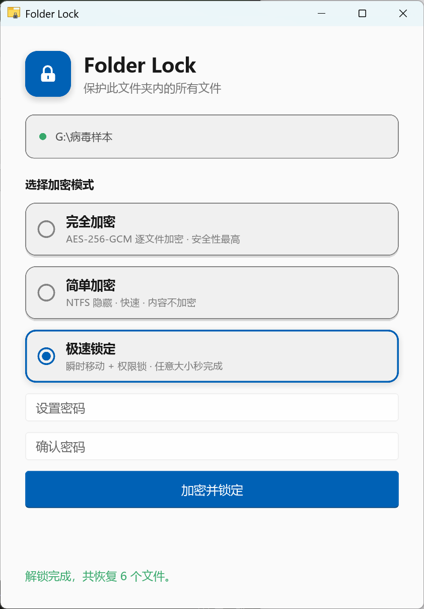

# Folder Lock

一个 Windows 文件夹加密/隐藏工具。将 `folder_lock.exe` 放入任意文件夹运行，即可用密码保护整个文件夹。轻量、免安装、单文件交付，无运行时依赖。




## 三种加密模式

| 模式 | 速度 | 安全性 | 原理 |
|------|------|--------|------|
| **完全加密** | 较慢（逐文件加密） | 最高 | AES-256-GCM 加密所有文件内容 |
| **简单加密** | 瞬时（大文件夹秒完成） | 中等 | NTFS ADS 流隐藏文件，AES 仅加密文件名清单 |
| **极速锁定** | 瞬时（任意大小秒完成） | 中等 | `fs::rename` 移动到隐藏容器 + ACL 权限锁 |

### 完全加密
- 使用 AES-256-GCM 认证加密保护每个文件
- 密钥由 Argon2id（64 MiB / 3 轮）从密码派生，抗暴力破解
- 文件内容完全不可读，vault 被篡改也会被 GCM 标签检测

### 简单加密
- 文件原始内容存入 NTFS Alternate Data Streams（`文件:流名`）
- 文件本体设为隐藏+系统属性，ADS 在资源管理器和普通 `dir` 中完全不可见
- 仅文件名清单（manifest）用 AES-256-GCM 加密，适合大文件夹

> **注意**：简单加密只“隐藏”文件而不加密内容。任何能读取 ADS 的工具（如 `dir /r`）都能看到文件数据。

### 极速锁定
- 通过 `fs::rename` 将所有文件移动进隐藏容器目录 `.flockdata`（NTFS 同卷仅改元数据，毫秒级完成，与文件大小无关）
- 容器目录随后被施加 ACL 拒绝规则（Everyone / `S-1-1-0` 拒绝完全控制）作为附加保护层
- 解锁时先移除 ACL 拒绝，再按清单把文件移回原位
- 文件名清单用 AES-256-GCM 加密

> **注意**：极速锁定同样不加密文件内容，安全性依赖“移动隐藏 + 权限拒绝”。仅适用于 NTFS 同卷。

## 使用方式

### GUI 程序（`folder_lock.exe`）

现代化 Slint 界面，**自动跟随 Windows 深/浅色主题**。

1. 将 `folder_lock.exe` 复制到目标文件夹
2. 双击运行
3. 选择加密模式（完全加密 / 简单加密 / 极速锁定）
4. 设置密码并确认，在确认对话框中再次确认
5. 加密完成后，文件夹内除 exe 外所有文件消失，**文件夹图标变为 app 图标**（提示已锁定）
6. 再次运行输入密码即可解密恢复

#### 解锁方式
- **解密并解锁**：彻底解除加密，恢复文件并清除内存中的密码
- **临时解密**：输入密码后恢复文件供临时使用，密码与模式暂存内存，界面显示 **「再次加密」** 按钮
  - 点击「再次加密」即以**原模式一键重新锁定，无需再次输入密码**
  - 重新加密成功后内存凭据立即清零

### 命令行（`flock_cli.exe`）

```cmd
flock_cli status                    查看文件夹状态
flock_cli encrypt <密码>            完全加密
flock_cli encrypt-simple <密码>     简单加密
flock_cli encrypt-move <密码>       极速锁定（移动 + 权限锁）
flock_cli decrypt <密码>            解密（自动识别模式）
```

> CLI 为脚本/测试用的无界面入口，仅执行原始 vault 操作；文件夹图标与临时解密为 GUI 专属功能。

## 技术细节

| 组件 | 说明 |
|------|------|
| 加密算法 | AES-256-GCM（认证加密） |
| 密钥派生 | Argon2id，64 MiB 内存，3 轮迭代 |
| 随机数 | 每次加密生成随机 salt（16 字节）+ nonce（12 字节） |
| Vault 文件 | `.flockvault` — 隐藏+系统属性，包含 salt + 模式 + 加密清单 |
| ADS 载体 | `.flockhost` — 隐藏+系统属性，承载所有文件的 ADS 流（简单模式） |
| 隐藏容器 | `.flockdata` — 隐藏目录 + ACL 拒绝，存放被移动的文件（极速锁定模式） |
| 文件夹图标 | 锁定时写入隐藏 `desktop.ini` 指向 exe 图标，文件夹置只读标记；解锁时清除并刷新资源管理器 |
| GUI 框架 | Slint 1.17（fluent 风格，自动跟随系统主题；矢量锁图标；后台线程处理不卡界面） |
| 内存安全 | 派生密钥用后 zeroize；临时解密暂存的密码在 Drop 时清零 |

## Vault 格式

```
[salt: 16 bytes]            明文 salt
[mode: 1 byte]              0 = 完全加密，1 = 简单加密，2 = 极速锁定
[manifest ciphertext...]    nonce || AES-256-GCM(manifest)
```

解密时自动检测模式，无需用户指定。

## 构建

```cmd
cargo build --release
```

依赖：
- Rust GNU 工具链
- LLVM MinGW（提供 `windres` 用于编译图标/清单资源）
- 构建时 `build.rs` 自动生成应用图标（`assets/icon.ico` 供 exe 资源、`assets/icon.png` 供 Slint 窗口标题栏），并编译 `ui/app.slint`

产物：
- `folder_lock.exe` — Slint GUI 主程序
- `flock_cli.exe` — 无界面命令行工具

## 安全须知

- **密码不可找回** — 无后门，忘记密码则无法解密
- 简单加密与极速锁定模式的文件内容**未经加密**，仅通过隐藏/权限保护；重要文件请使用**完全加密**
- 不要在非 NTFS 卷（如 FAT32/exFAT/U盘）上使用简单加密或极速锁定，ADS 与同卷 rename 特性不支持
- 临时解密期间密码驻留内存以支持一键重锁，重新加密或关闭程序后失效
